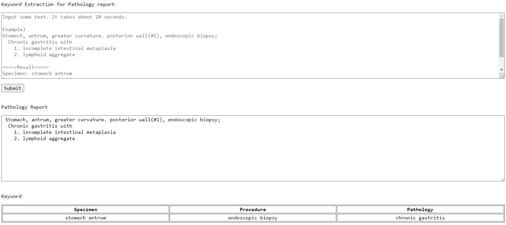

# Keyword-Extraction-for-Pathology-Reports-with-BERT
This is Keyword extraction for pathology report based on the pre-trained BERT.  
We refered [BERT] (Devlin, et al.).

## For NOT programmer users 
[KEP] is a web-based **keyword** **extraction** **tool** for pathology report.  
Users who are not familiar with python can use this tool.  
  
Screenshot

## Environments

	python 3.6  
	pytorch 1.2.0  
	pytorch-pretrained-bert 0.6.2  

## Usage

Example:  

	python Keyword_Extraction_BERT.py --data sample.csv

Arguments:  

	--data DATA      Data  
	--maxlen MAXLEN  Max Length  
	--bs BS          Batch Size  
	--lr LR          Learning Rate  
	--epoch EPOCH    Epochs  

[KEP]: http://cdal.korea.ac.kr/KEP/kep.php
[BERT]: https://github.com/google-research/bert